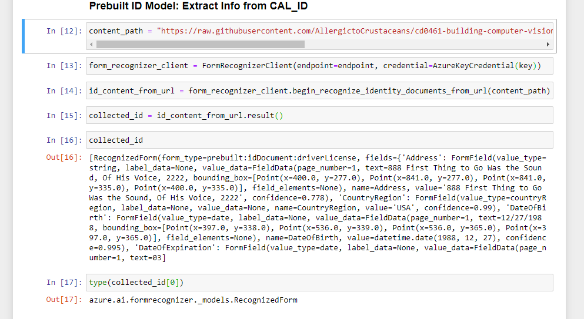
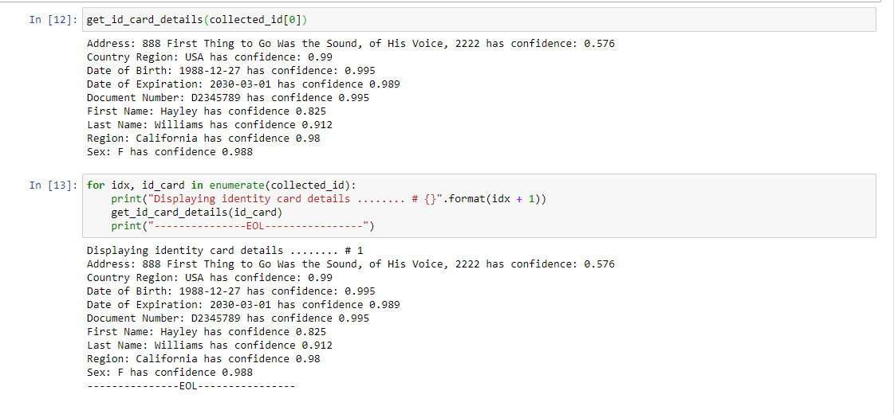
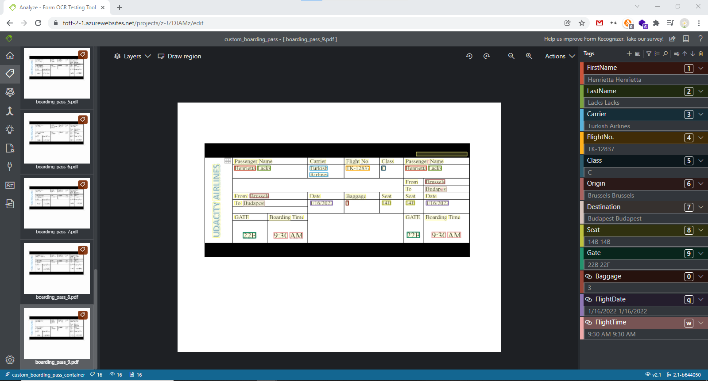
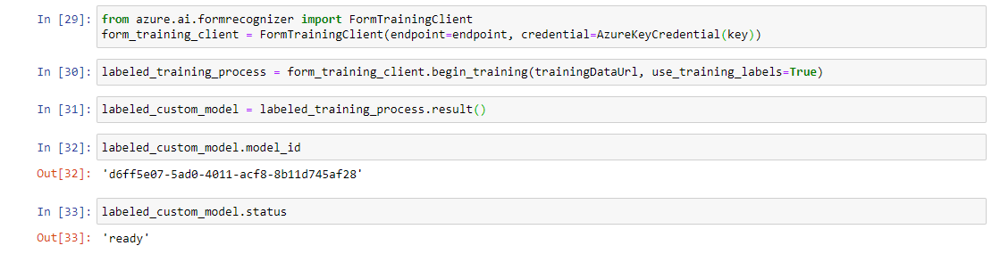
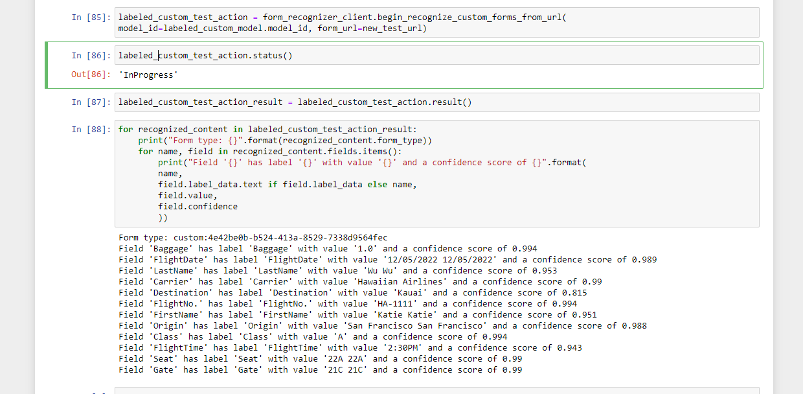
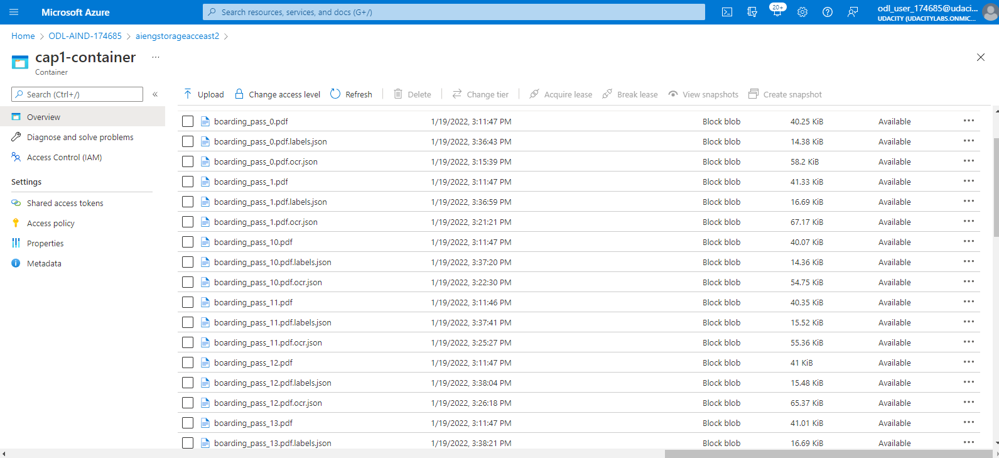

# Text Extraction 

#### 1.) Use Form Recognizer API to Extract Digital ID Info

#### 2.) Extracted Digital ID data Matches CA ID Info

#### 3.) Use Web Portal to Generate Boarding Pass Labels 

#### 4.) Train Custom Boarding Pass Recognition Model

#### 5.) Use Custom Model to Extract Boarding Pass Info

#### 6.) Boarding Passes + Training Layout Labels Stored in Azure Storage

