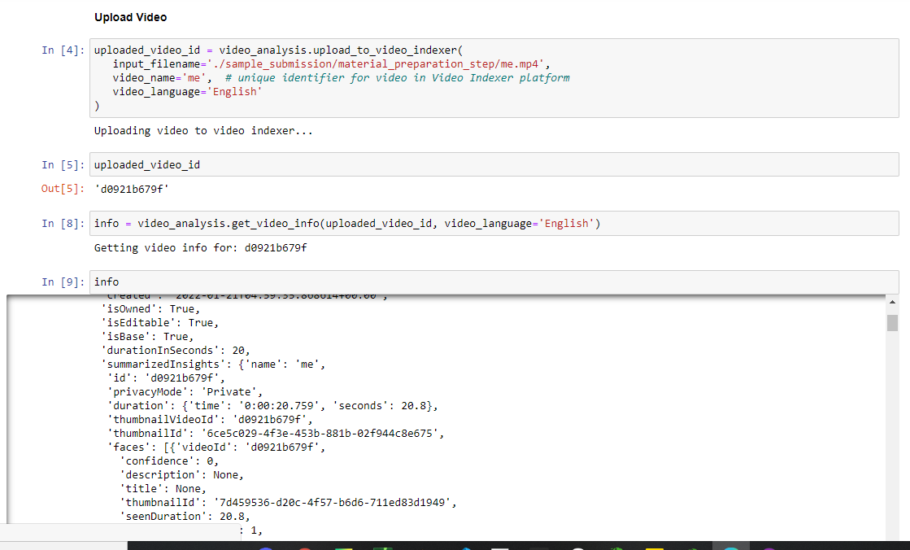
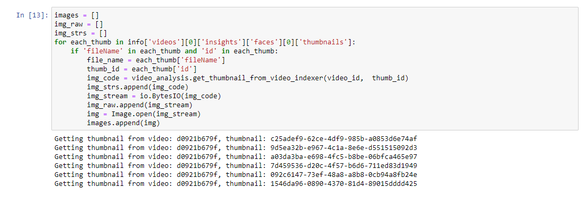
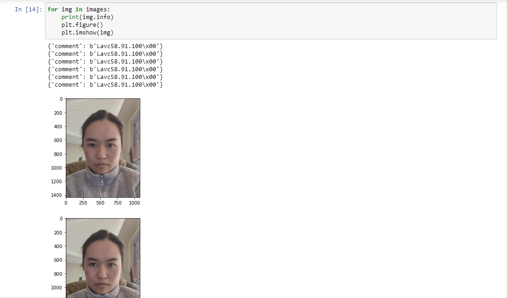
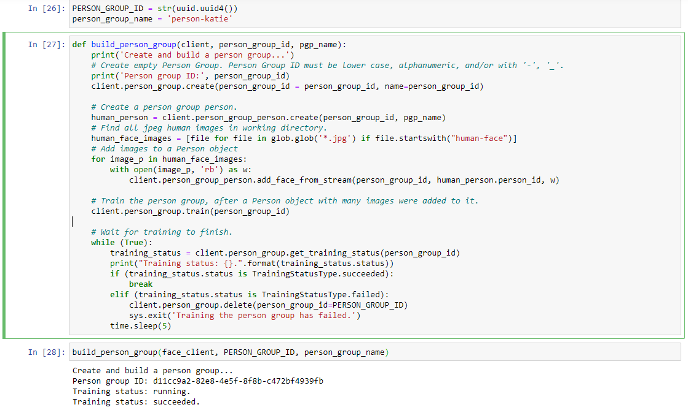
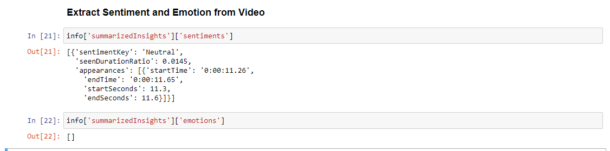
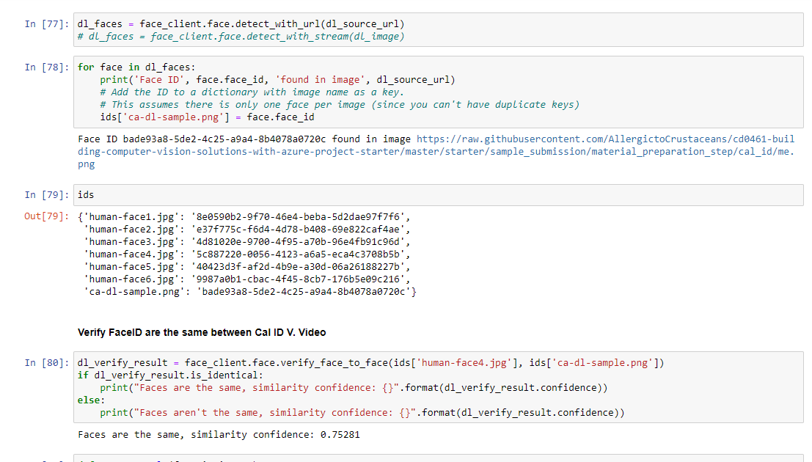
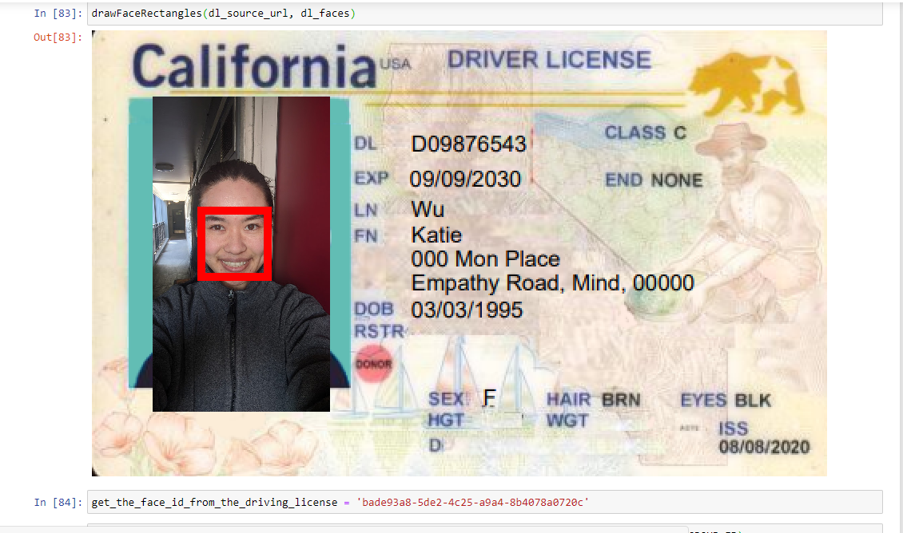

# Face Recognition

#### Upload vid to Azure Video Analyzer

#### Face Thumbnail Extracted from Azure Video Analyzer API

#### Create Person model 

#### Display emotion + sentiment from Azure Video Analyzer API

#### Use Extracted Cal ID Info as Input Data 

