# Object Detection

## Images Labeled on Web Portal
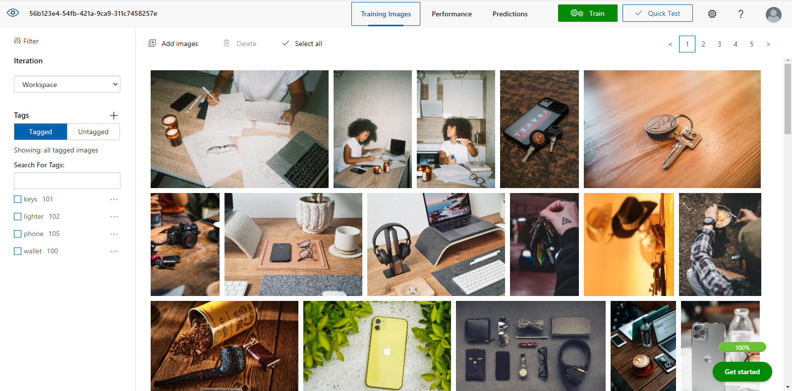
#

## Initiate Training on Model via SDK
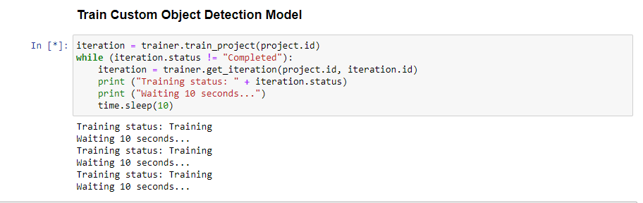
#

## Perform Training of Model on Web Portal
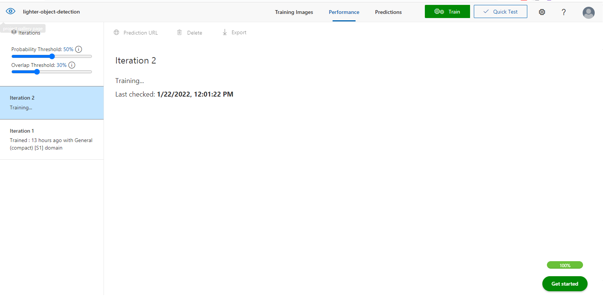
# 

## Perform Validation Process of Model on Web Portal
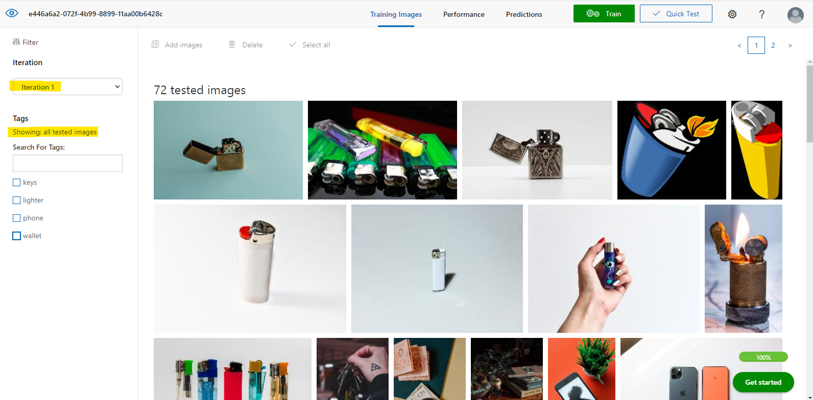
#

## Precision and Precall of Model
*Since the project requires that the `precision value` of the object detection model be over 75%, the following screenshots of my ML model performance will have to do. I could not for the life of me get recall value to be over 75%. *
#

## Screenshot of the Object Detection Model Precision Requirement: 
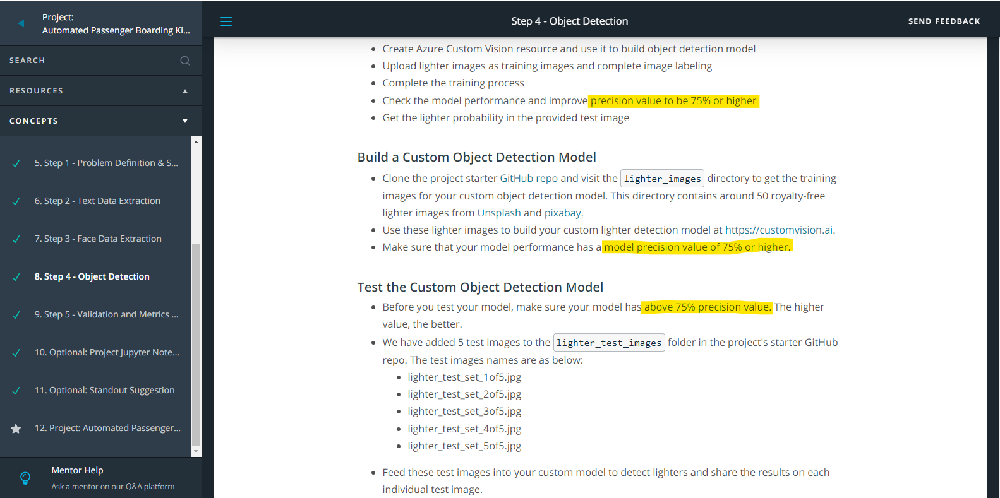
#

## Screenshot from First Submission:
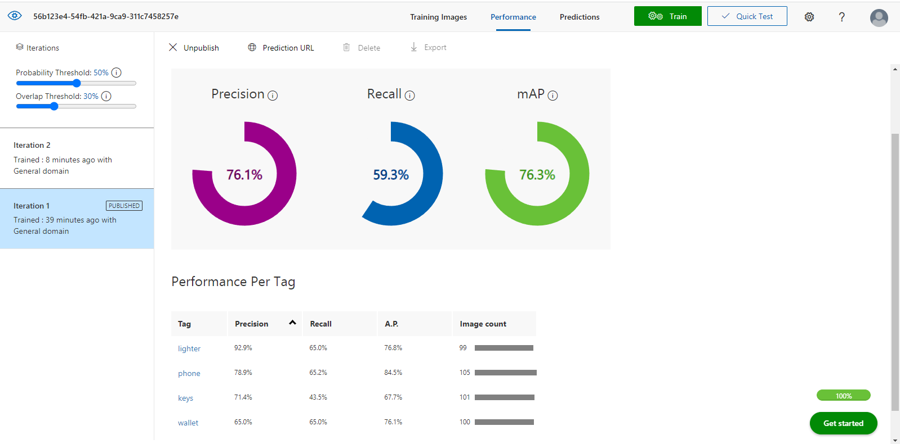
#

## Screenshot from Second Submission:
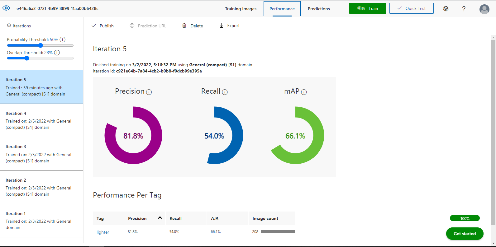
#

## Model Deployed to an Endpoint
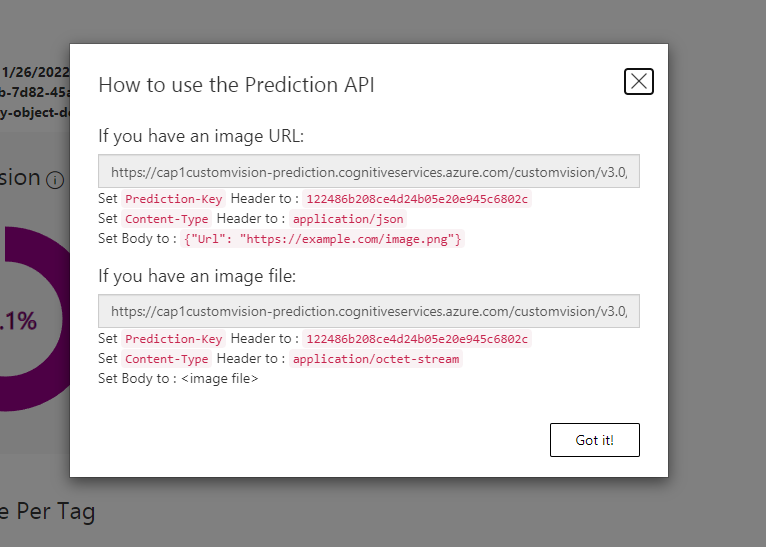
#

## Use Endpoint to Predict
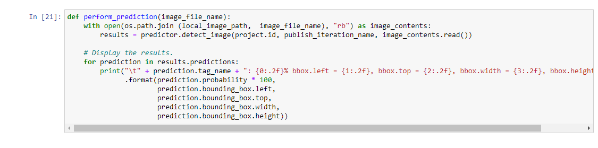
#

## Prediction Values of 5 Test Images

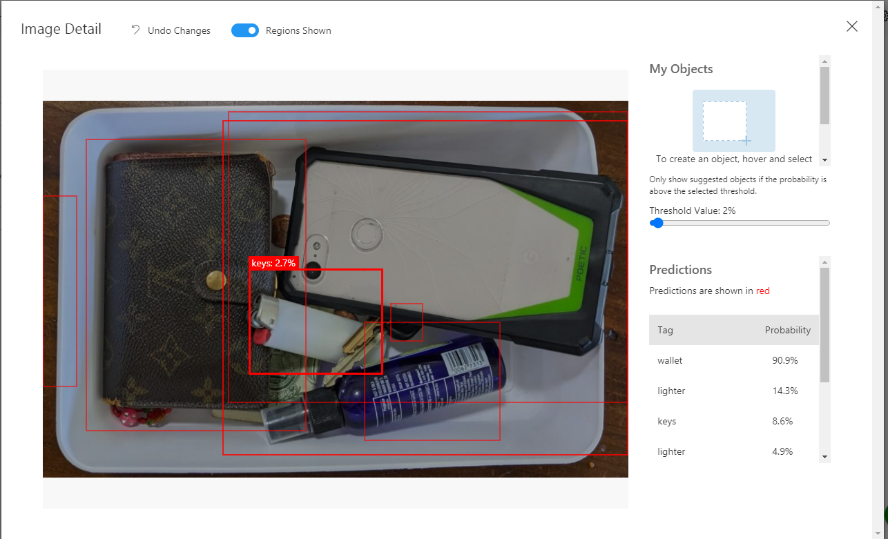

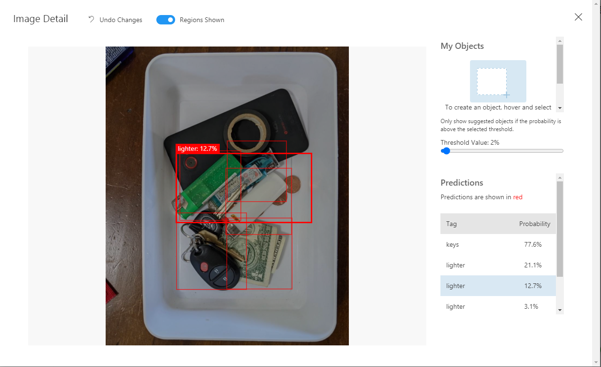

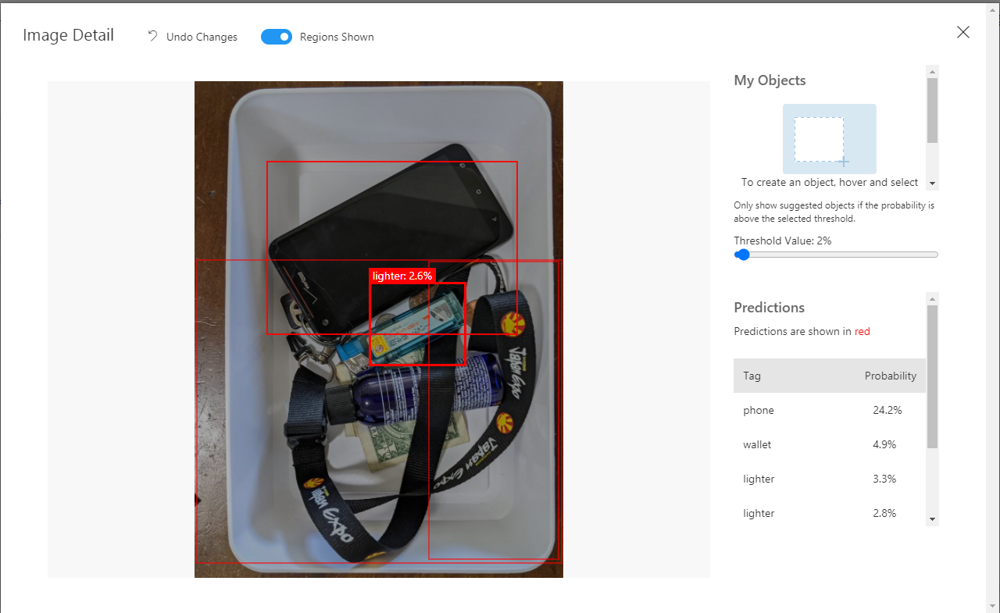

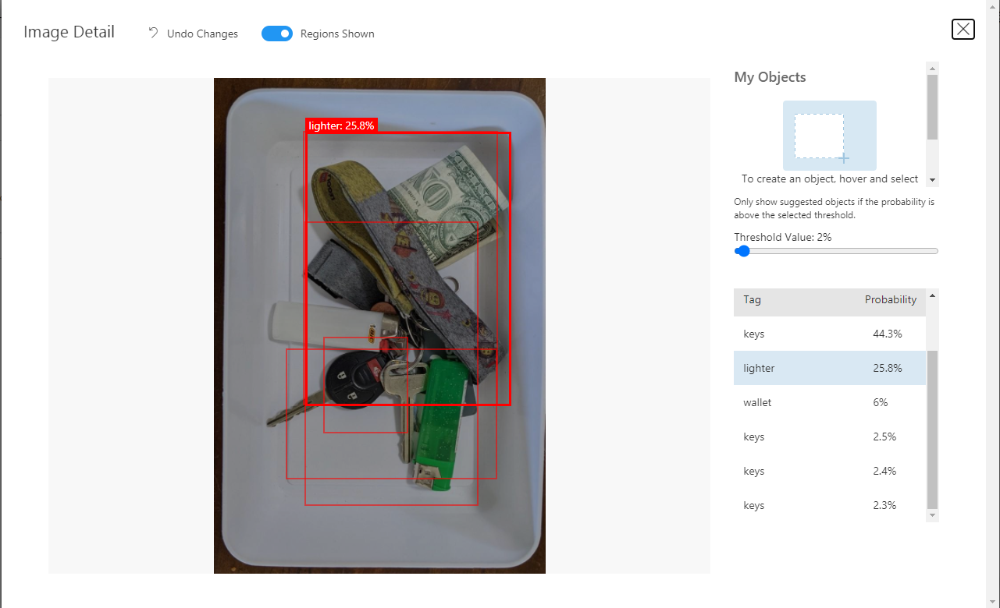

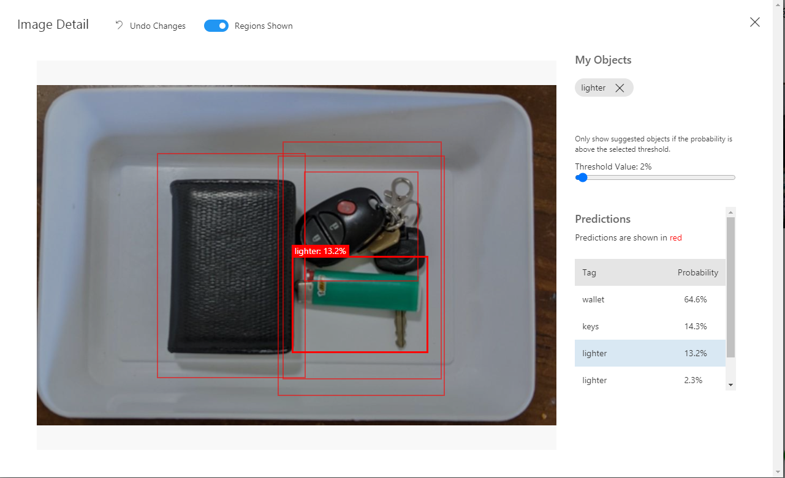

#

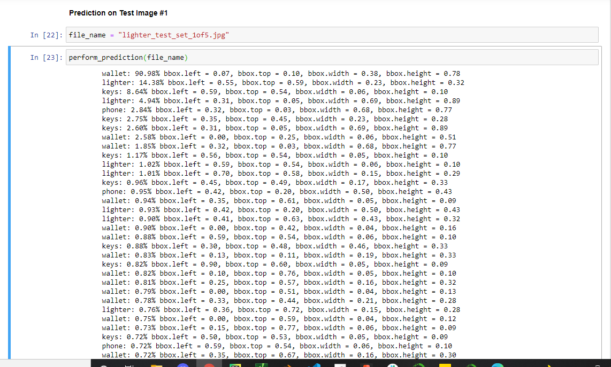

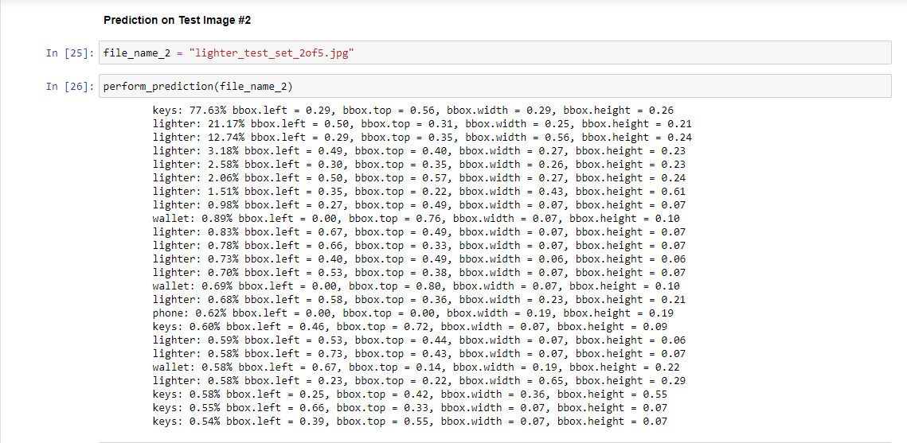

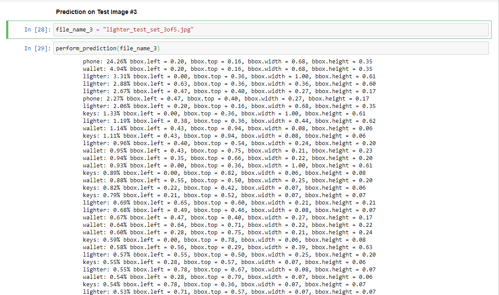

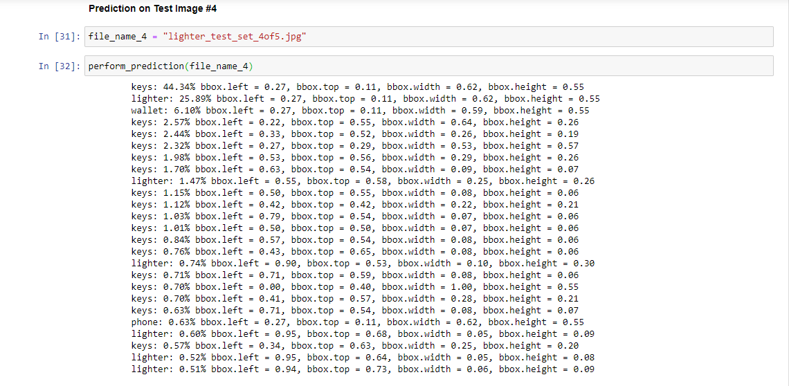

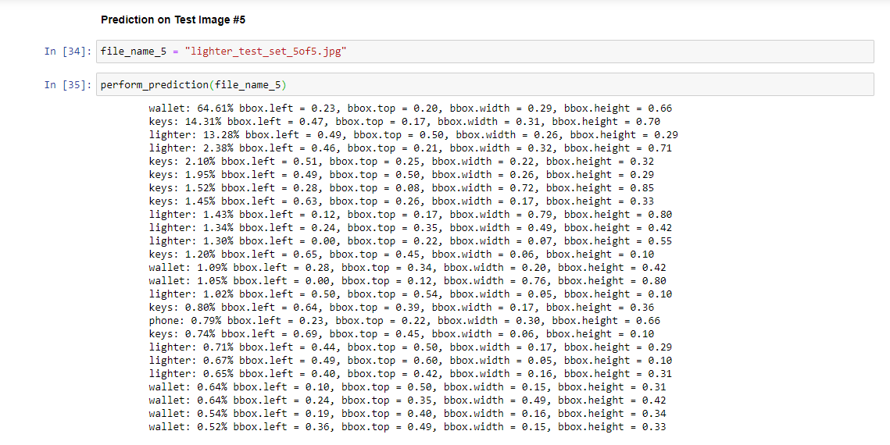