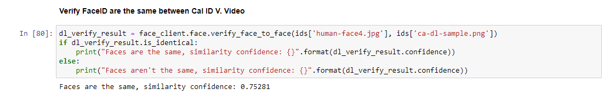
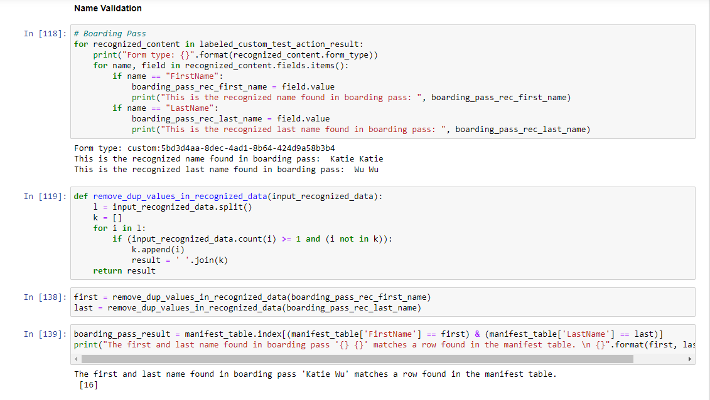
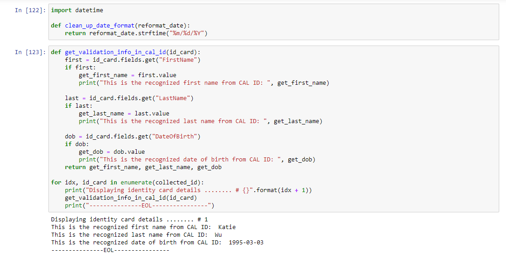
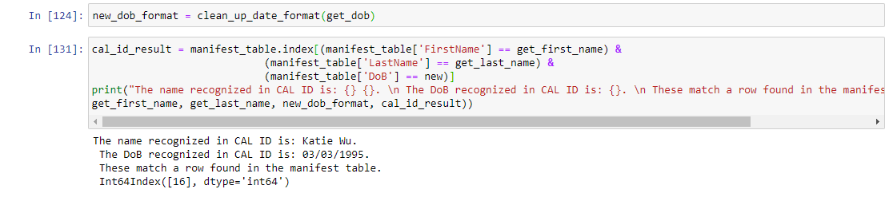
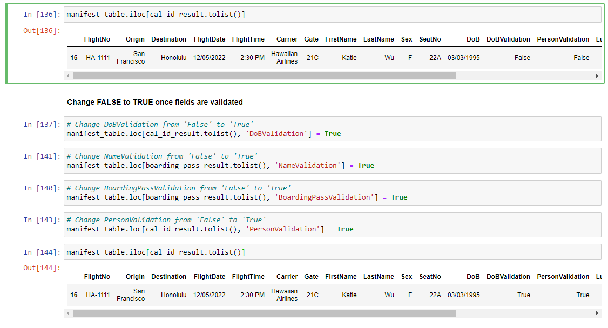
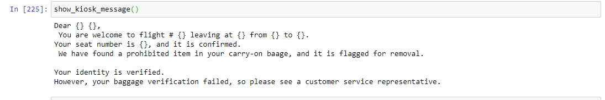

# Validation & Metrics Monitoring

#### List of Python libraries used in this capstone project

[Link to the requirements.txt](./requirements.txt)

#### Face Matching has X% match between Video Thumbnail + Cal ID

#### Validation Results from Cal ID, Boarding Pass, and Face Video

#### All Successful Validations

Unforunately, there were no successful validations, luggage validation was defaulted to FALSE (as stated on step 5 instructions)

#### Error Message of Failed Validations

#### Record Updates on Manifest Table

[Link to the updated CSV file](./flight_manifest_table_updated.csv)

#### Usage + Performance from Service Consumption Report

#### Reflection 