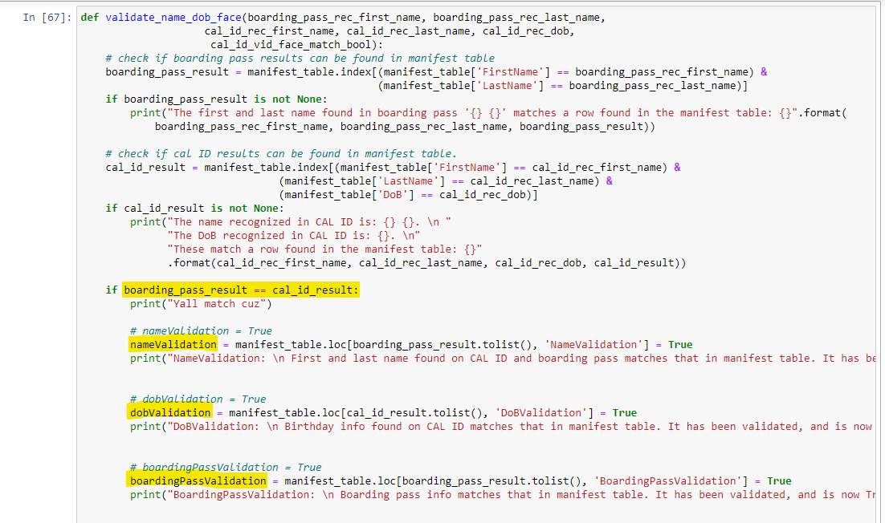
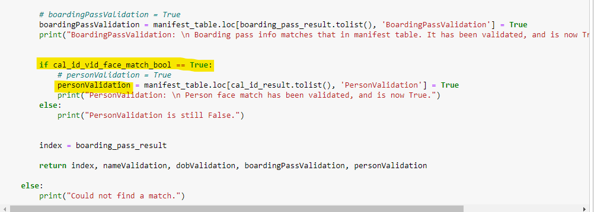
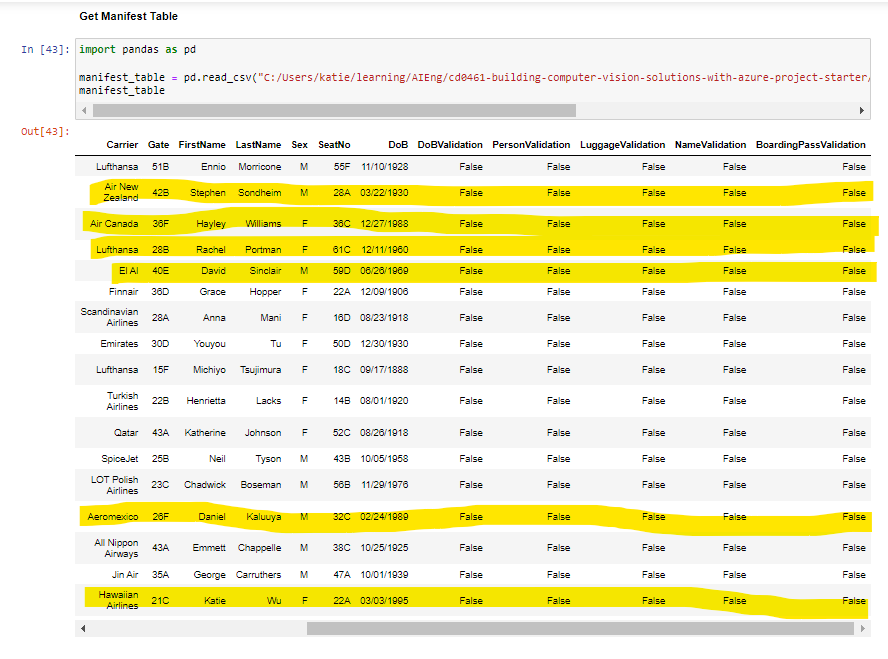
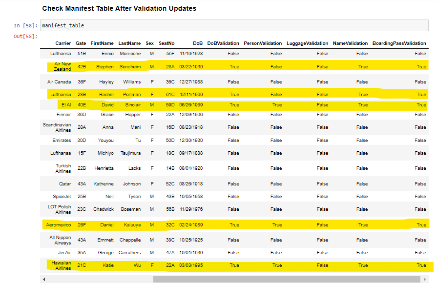
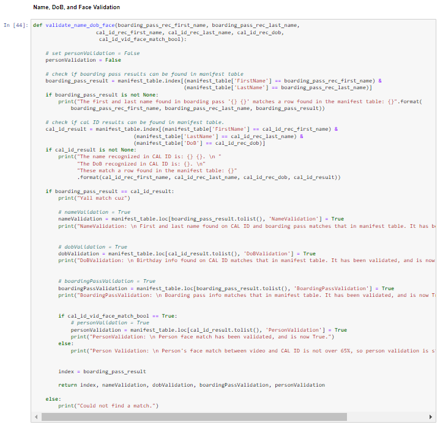
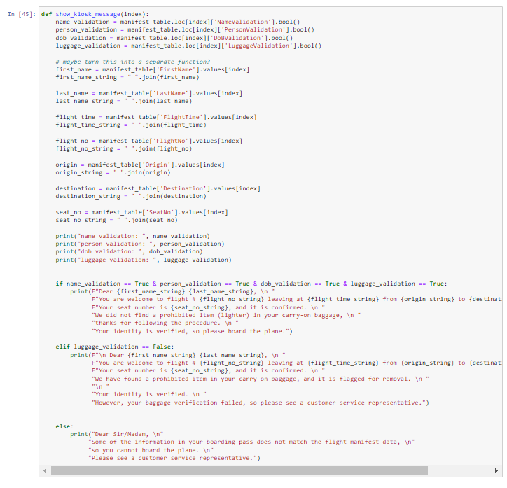
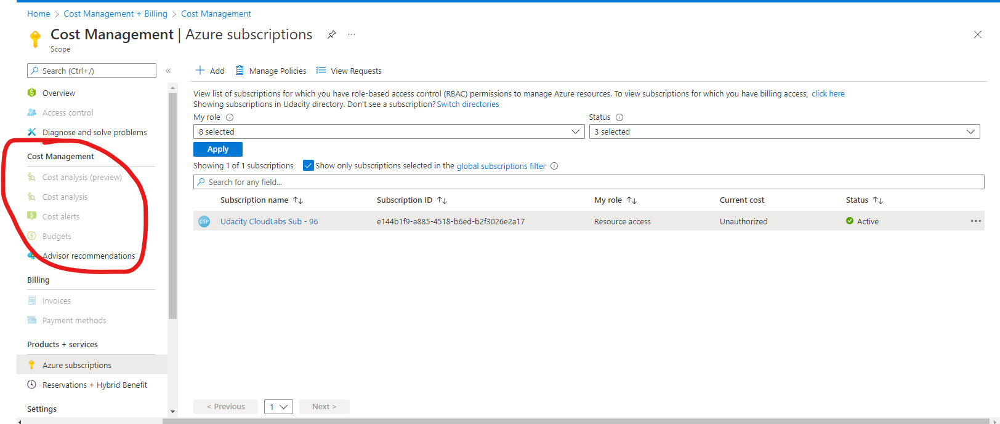
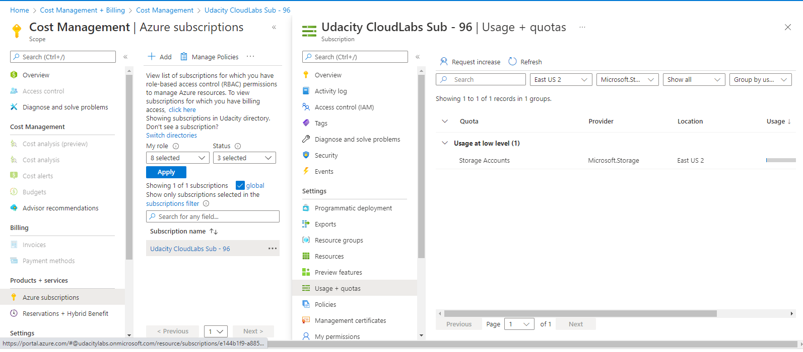

# Validation & Metrics Monitoring

## List of Python libraries used in this capstone project

[Link to the requirements.txt](./requirements.txt)
#

## Face Matching has X% match between Video Thumbnail + Cal ID

## Validation Results from Cal ID, Boarding Pass, and Face Video

This is the very long function that I created to validate the extract information. 

Continuation of the function... 

This is the function that stores a True/False value for the personValidation variable, once a person's face V. vid confidence is determined.

#

## Manifest Table Before Validation Checks
This is what the manifest table (CSV) looks like the following subjects in preparation for testing: 

#

## Link to Validation Checks
Here are the validation checks for each subject:

[My Validation Results](./my_results) (VALIDATION PASSED)

[Daniel Kaluuya's Results](./kaluuya_results) (VALIDATION PASSED)

[Ennio Morricone's Results](./morricone_results) (VIDEO IMAGE EXTRACTION FAILED -- did not continue to validate)

[Stephen Sondheim's Results](./sondheim_results) (VALIDATION FAILED)

[Hayley Williams' Results](./williams_results) (PERSON GROUP ERROR -- did not continue to validate)

[David Sinclair Results](./sinclair_results) (VALIDATION PASSED)

[Rachel Portman Results](./portman_results) (VALIDATION PASSED)

#
## Updated Manifest Table After Validation Checks
This is what the manifest table (CSV) looks like after the subjects were checked for validation: 

#

## Helper functions to validate Text Extraction, Face Recog Checks

## All Successful Validations

Unforunately, there were no successful validations, luggage validation was defaulted to FALSE (as stated on step 5 instructions)

### Error Message of Failed Validations

#

## Usage + Performance from Service Consumption Report

I used the Jupyter lab provided by Udacity, and when checking the cost management tab, it's disabled. 

#

## Reflection 
[Capstone Reflection](./capstone1_reflection.pdf)