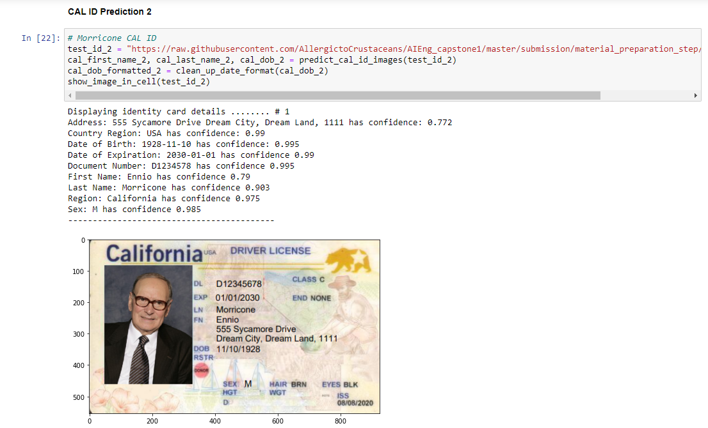
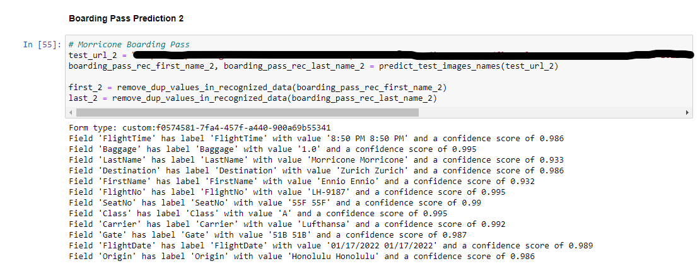

# Morricone Validation Results

## Show CAL ID 

#

## Show Boarding Pass Text Extraction

#

## Verify CAL ID Photo V. Video Face Recognition Thumbnail Match

#

## Verify `PersonValidation` from Face Recognition
*Could not do personValidation check, since the video imported did not detect any images of Morricone.*

#

## Verify Kiosk Message Based on Validation Checks
*I chose to no longer try to validate Morricone's information, since the video analyzer Azure service could not detect images of Morricone. So I validated an extra user to compensate for the ending of this one.*