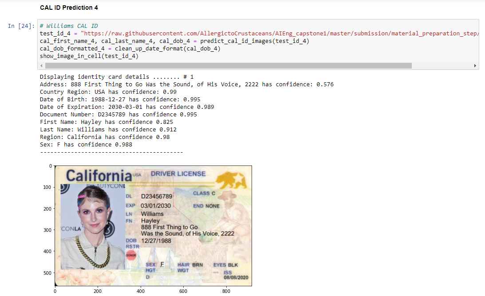
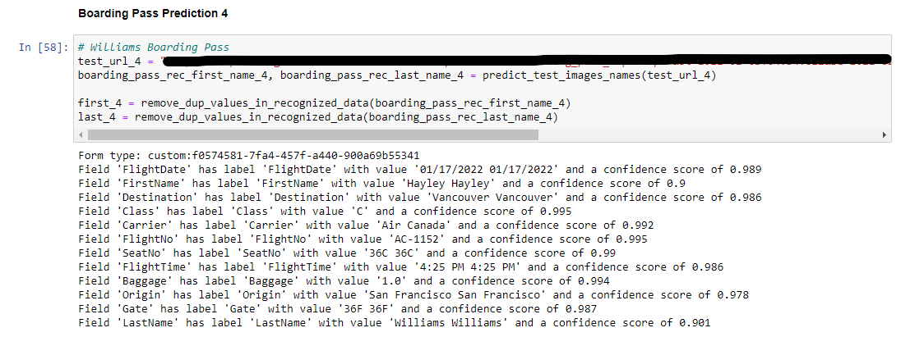
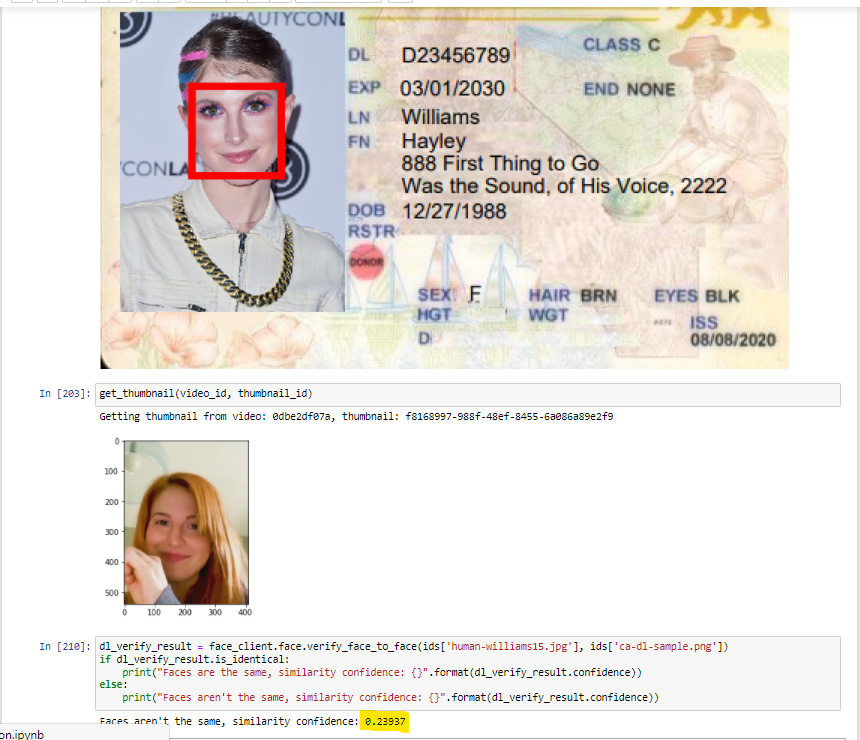

# Williams Validation Results

## Show CAL ID 

#

## Show Boarding Pass Text Extraction

#

## Verify CAL ID Photo V. Video Face Recognition Thumbnail Match

#

## Verify `PersonValidation` from Face Recognition
*Could not do PersonValidation check since the PersonGroup creation had an error. I chose not to continue verifying this user, which leaves a total of 5 remaining users still validated in this project. *

#

## Verify Kiosk Message Based on Validation Checks
*Since I ould not generate a proper PersonValidation result, I could not generate an accurate kiosk message. I chose not to continue verifying this user, which leaves a total of 5 remaining users still validated in this project. *